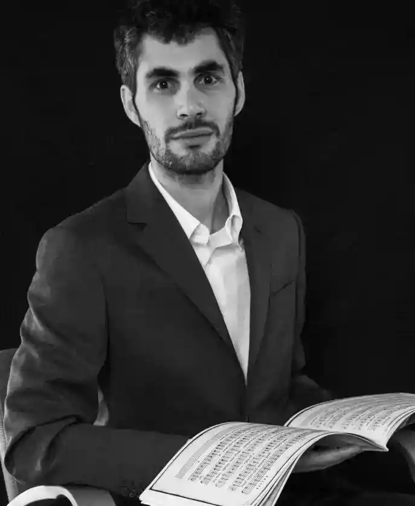
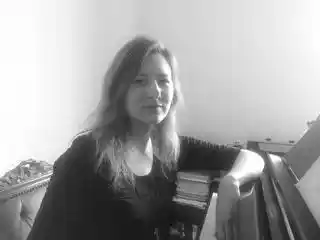
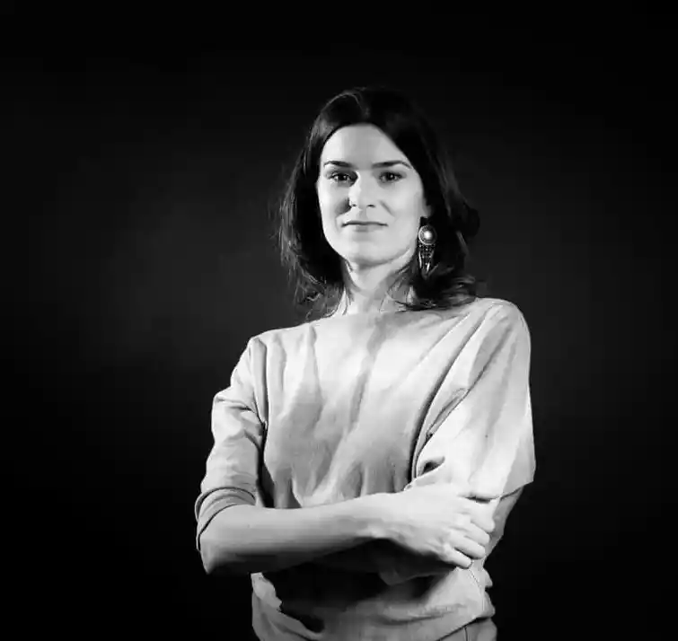
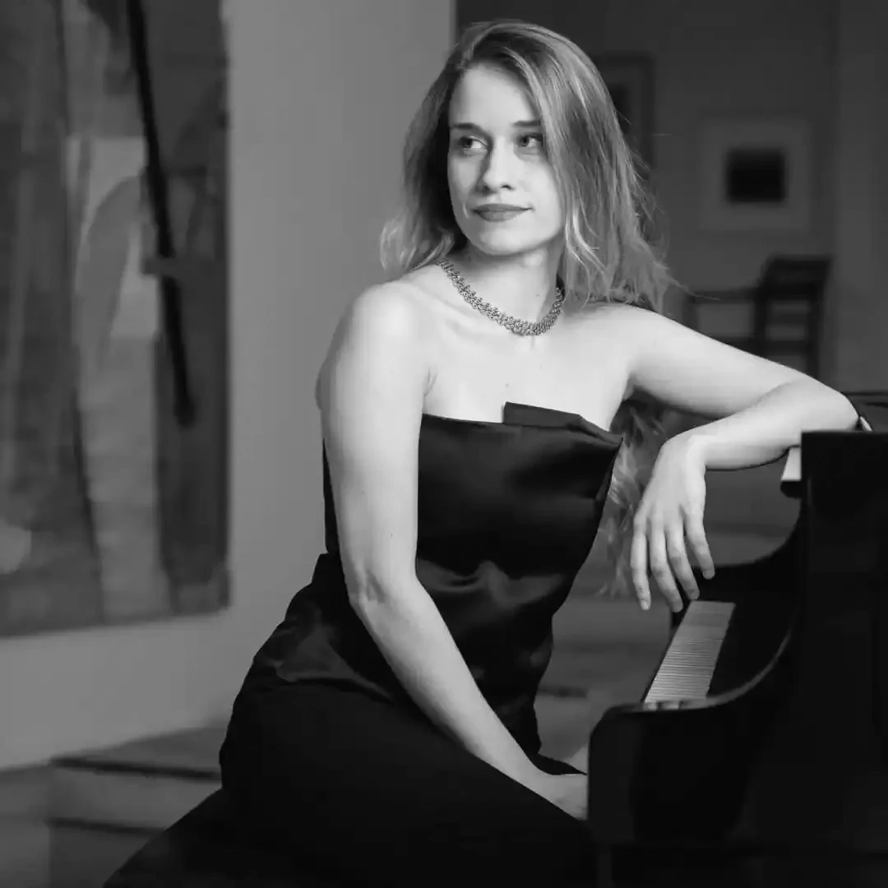
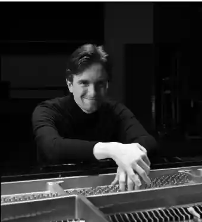
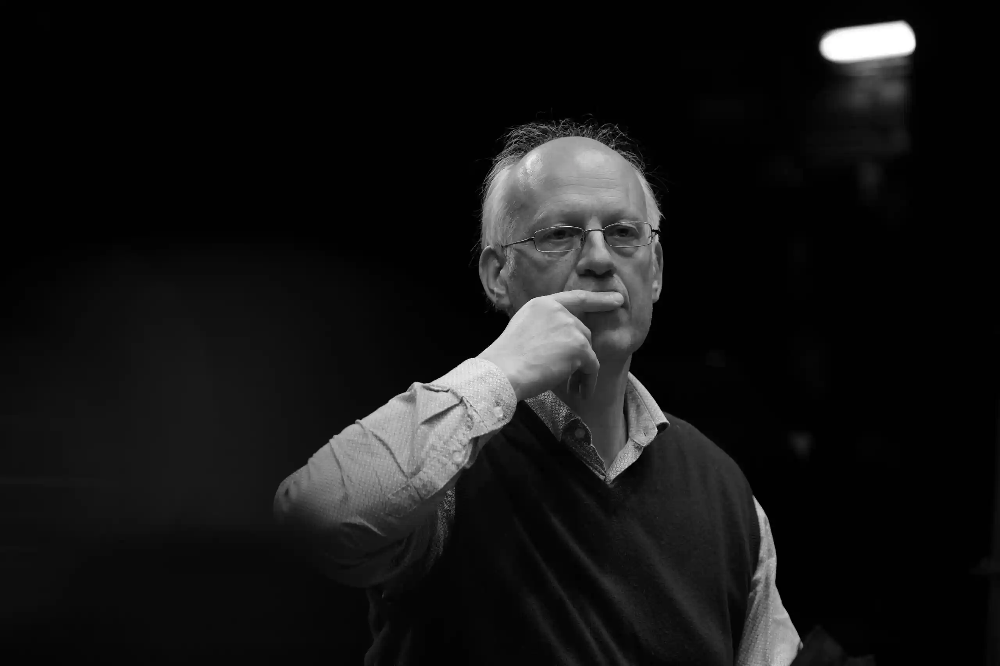

---
hide:
  -title
  -toc
---

#

## Royal Conservatoire Antwerp

{align="left" width="150"} 
**[Nicholas Cornia](https://www.ap-arts.be/persoon/nicholas-cornia)**
---
_Principal investigator_

    

{align="left" width="150"}
**[Hannah Aelvoet](https://www.ap-arts.be/persoon/hannah-aelvoet)**
---
_Fellow researcher and library staff_

  

{align="left" width="150"}
**[Pauline Lebbe](https://www.ap-arts.be/persoon/pauline-lebbe)**
---
_Research coordinator_ Labo XIX&XX

  

## Partners

{align="left" width="150"}
**[Anna Alvizou](https://www.annaalvizou.com/)**
---
_Freelance pianist involved in the_ [Imaginary Conversation with Marinus de Jong](https://vimeo.com/1019096618/aa60bf7d8e) project.

  

{align="left" width="150"}
**[Ossama Belliraj]()**
---
_Student at Ghent University, author of_ [Feature-Based Detection of Handwritten Annotations on Historical Sheet Music](https://github.com/nicholascornia89/faam/blob/main/output/belliraj-masterthesis-2025/Masters_thesis_Ghent_University_Faculty_of_Engineering_and_Architecture_Ossama_Belliraj.pdf) master thesis and associated [GitHub repository](https://github.com/ossama-belliraj/Thesis-2025). Supervisors: **[Jan Aelterman](https://research.ugent.be/web/person/jan-aelterman-0/nl)** and **[Anoek Strumane](https://research.ugent.be/web/person/anoek-strumane-0/nl)**

  

{align="left" width="150"}
**[Viktor Lazarov](https://www.viktorlazarov.ca/)**
---
_Canadian pianist and researcher, co-author of the_ [Echos du temps passé](https://github.com/nicholascornia89/echos_du_temps_passe) project.

  

{align="left" width="150"}
**[Florian Heyerick](http://www.heyerick.org/)**
---
_Belgian conductor and music educator involved in the_ [Missa Romantica](https://vecchiemusiche.be/projects/missa_romantica/) project.

  

This project has been founded by the artistic research group [Labo XIX&XX](https://ap-arts.be/en/researchgroup/labo-xixxx) at the [Royal Conservatoire of Antwerp](https://ap-arts.be/en) between September 2022 and October 2025.

Most of the digitized material has come from the [Heritage Library of Antwerp Conservatoire](https://www.libraryconservatoryantwerp.be/en) and the [Conservatoire Library of Ghent](https://schoolofartsgent.be/en/artistic-activities/muziekbibliotheek), but also [Orpheus Instituut](https://orpheusinstituut.be/en/about-us/library) and other international partners such as the [Benedetto Marcello Conservatoire Library of Venice](https://www.conservatoriovenezia.eu/biblioteca/).

